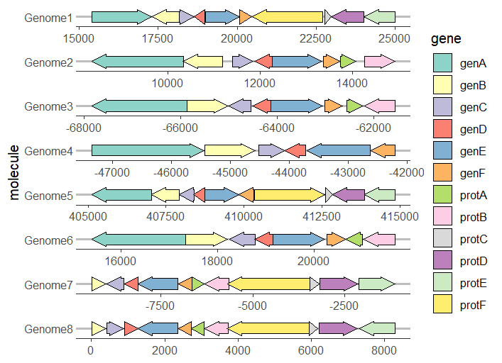
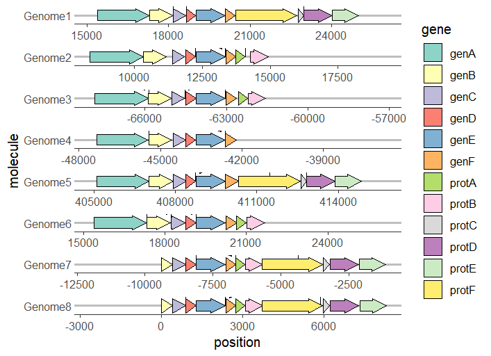
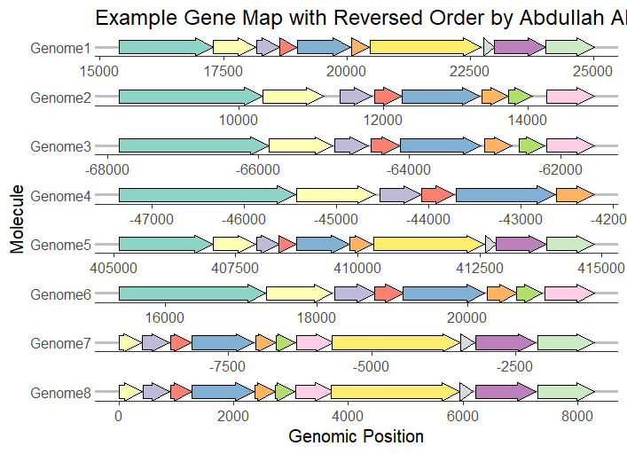
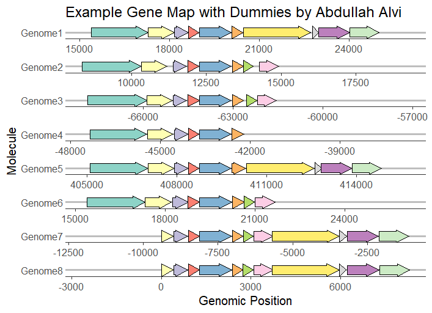
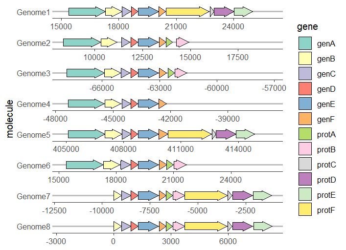

# R-Genomic-Visualization
R-Genomic-Visualization
## 👤 Author

**Abdullah Alvi**  
📧 Connect with me on [LinkedIn](https://www.linkedin.com/in/) | [GitHub](https://github.com/)
# 🧬 Genomic Visualization with gggenes in R

> Gene arrow map visualizations using the `gggenes` package in R, built on top of `ggplot2`.



---

## 📌 About This Project

This project explores the **gggenes** R package for creating publication-ready gene arrow maps. It demonstrates how to visualize genomic data across multiple genomes with various customization options — all using clean, minimal R code.

The visualizations were created by **Abdullah Alvi** using **RStudio (R 4.5.2)**.

---

## 📊 Visualizations Created

| Plot | Description |
|------|-------------|
| Basic Gene Map | Simple arrow map across 8 genomes using `geom_gene_arrow()` |
| Gene Map with Features | Feature annotations added using `geom_feature()` and `geom_feature_label()` |
| Reversed Order Map | Genome order reversed using `scale_y_discrete()` |
| Orientation-based Map | Forward/reverse strand directions shown via arrow orientation |
| Gene Map with Dummies | Dummy genes added for alignment across genomes |

---

## 🖼️ Sample Outputs

### Basic Gene Arrow Map


### Gene Map with Feature Annotations


### Reversed Order Gene Map


### Gene Map with Dummies


---

## 🛠️ Packages Used

```r
library(ggplot2)
library(gggenes)
```

---

## 💻 Code

### Basic Gene Arrow Map

```r
ggplot(example_genes, aes(xmin = start, xmax = end, y = molecule, fill = gene)) +
  geom_gene_arrow() +
  facet_wrap(~ molecule, scales = "free", ncol = 1) +
  scale_fill_brewer(palette = "Set3") +
  theme_genes() +
  theme(legend.position = "none") +
  labs(
    title = "Example Gene Map by Abdullah Alvi",
    x = "Genomic Position",
    y = "Molecule"
  )
```

### Gene Map with Feature Annotations

```r
ggplot(example_genes, aes(xmin = start, xmax = end, y = molecule, fill = gene)) +
  geom_gene_arrow() +
  geom_feature(
    data = example_features,
    aes(x = position, y = molecule, forward = forward)
  ) +
  geom_feature_label(
    data = example_features,
    aes(x = position, y = molecule, label = name, forward = forward)
  ) +
  facet_wrap(~ molecule, scales = "free", ncol = 1) +
  scale_fill_brewer(palette = "Set3") +
  theme_genes() +
  labs(title = "Example Gene Map with Features by Abdullah Alvi")
```

### Reversed Gene Order

```r
ggplot(example_genes, aes(xmin = start, xmax = end, y = molecule, fill = gene)) +
  geom_gene_arrow() +
  facet_wrap(~ molecule, scales = "free", ncol = 1) +
  scale_fill_brewer(palette = "Set3") +
  theme_genes() +
  theme(legend.position = "none") +
  labs(
    title = "Example Gene Map with Reversed Order by Abdullah Alvi",
    x = "Genomic Position",
    y = "Molecule"
  ) +
  scale_y_discrete(limits = rev(levels(example_genes$molecule)))
```

### Orientation-based Arrows

```r
ggplot(example_genes, aes(xmin = start, xmax = end, y = molecule, fill = gene,
                           forward = orientation)) +
  geom_gene_arrow() +
  facet_wrap(~ molecule, scales = "free", ncol = 1) +
  scale_fill_brewer(palette = "Set3") +
  theme_genes()
```

---

## 🚀 How to Run

1. **Install R and RStudio**
2. **Install required packages:**

```r
install.packages("ggplot2")
install.packages("gggenes")
```

3. **Load libraries:**

```r
library(ggplot2)
library(gggenes)
```

4. **Run any of the code snippets above** — the `example_genes` and `example_features` datasets are built into the `gggenes` package, so no external data is needed!

---

## 📁 Repository Structure

```
📦 gggenes-visualization
 ┣ 📜 README.md
 ┣ 📜 gggenes_plots.R        # All R code
 ┣ 🖼️ Rplot.png              # Basic gene map
 ┣ 🖼️ Rplot01.png            # Gene map with legend
 ┣ 🖼️ Rplot02.png            # Gene map with features
 ┣ 🖼️ Rplot03.png            # Reversed order map
 ┗ 🖼️ Rplot04.png            # Gene map with dummies
```

---

## 🔗 References

- [gggenes CRAN Page](https://cran.r-project.org/package=gggenes)
- [gggenes GitHub](https://github.com/wilkox/gggenes)
- [ggplot2 Documentation](https://ggplot2.tidyverse.org/)

---

## 👤 Author

**Abdullah Alvi**  
📧 Connect with me on [LinkedIn](https://www.linkedin.com/in/) | [GitHub](https://github.com/)

---

⭐ *If you found this useful, feel free to star the repo!*
